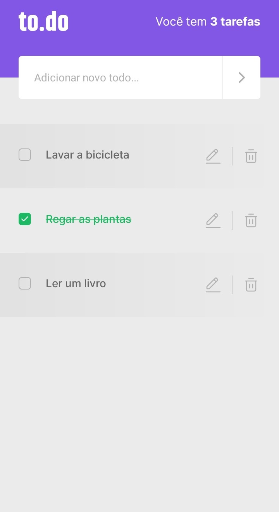

  

	
  
  
  
  
  

## 📖 About

This application is the first challenge from the [Ignite Bootcamp](https://rocketseat.com.br/ignite). The objetive is to develop the CRUD functions of a to-do list app.

## 📐 Layout

## 🚀 Technologies

- React Native
- Typescript

## 🔧 How to run

- Download this project to your computer or use the git command `git clone`
- Open the project folder in your system's shell
- Run `$ yarn install` to install the project's dependencies
- Run `$ yarn start`
- Run `$ yarn android` or `$yarn ios` to execute the app

##

   <b> &#60;/&#62; by <a href="https://www.linkedin.com/in/diegoventurasg/">Diego Ventura</a></b>

